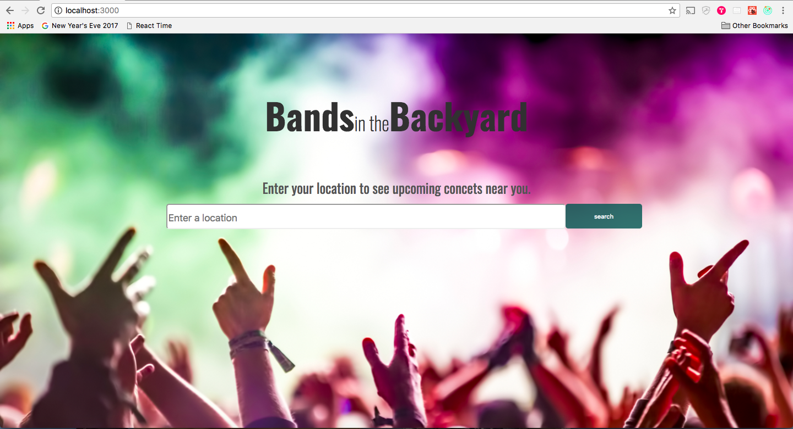
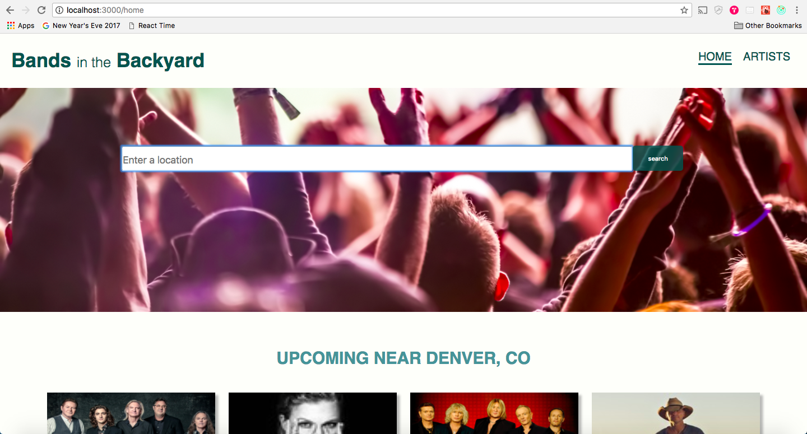
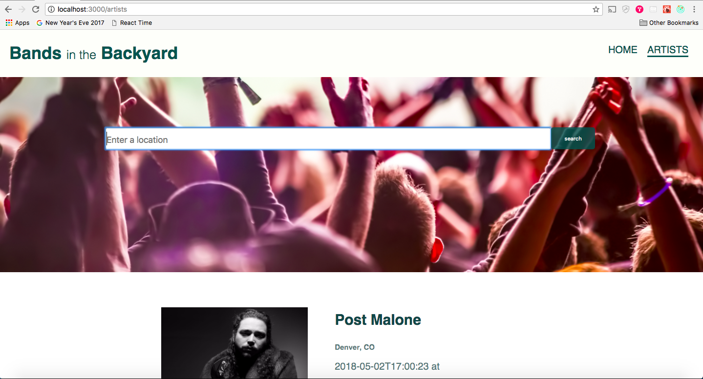

# Bands in the Backyard 

## About:

This project uses React in order to display upcoming concerts near the user. The user can search for different locations and can also search for their favorite artists and see if they have a concert coming up near the user. The project is pulling in data from the Ticket Master API and the Bands in Town API (public API). 

## Tech Stack:

  * JavaScript 
  * React
  * Redux
  * JSX
  * CSS
  * Thunk
  * Chai
  * Enzyme
  
  
## Set Up:

1. Clone down repo
2. `npm install`
3. In order to access data from the Ticket Master API, you will need to request an API key from Ticket Master and place it in    a file called `src/components/apiCall/apiKey.js`
4. To start the server: `npm start`
5. To run tests: `npm test`

## Screen Shots:

